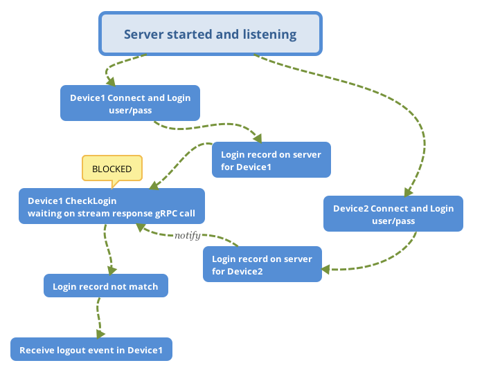

Cross platform user login system based on gRPC
======

A user register/login system based on gRPC C++, the client also implement in C++ and Android/iOS can share a same code base.

Just a simple demo application, including the following features

* User register
* User login
* User logout
* Client can received logout event if the same user login from a different new device, disable duplicated login
* Sensitive data is protected by `sslserver`/`sslchannel` only if client connect to server by hostname, fallback to `insecureserver`/`insecurechannel` if client connect to server by IP address which means the system is vulnerable 
* Use mysql and `mysqlx` protocol api for data persistence
* Currently, user password is stored via simple hash(`sha256`) algorithm, replace it with more security `bcrypt` password encoder

The following picture illustrate the design of this system from a developer perspective.


##### Prepare for Linux

In order to keep the same environment with docker, follow the [guide](https://github.com/grpc/grpc/blob/master/BUILDING.md) to build and install gPRC C++ for Linux, then install the requisite `libssl-dev` and `cmake`
```
$ apt install libssl-dev cmake
```

##### Build this project
 ci  by travis
```


How to prevent multiple login
------
The following steps and picture illustrate how to disable multiple login for same user from different devices.

1. user login in `Device1` with user/pass/device_id_1
2. new login record on server `user/device_id_1`
3. user check login status in `Device1` and waiting
4. user login in `Device2` with user/pass/device_id_2
5. new login record on server `user/device_id_2`
6. login record does not match for `Device1`, notify user in `Device1` to logout




TODO
------
* use bcrypt password hashing algorithm to hash user password instead use the simple SHA256


Reference
------
* [Generating a self-signed certificate using OpenSSL](https://www.ibm.com/support/knowledgecenter/en/SSMNED_5.0.0/com.ibm.apic.cmc.doc/task_apionprem_gernerate_self_signed_openSSL.html)
* [How to create a self-signed certificate with OpenSSL](https://stackoverflow.com/questions/10175812/how-to-create-a-self-signed-certificate-with-openssl)
* [gPRC Docker Library](https://github.com/grpc/grpc-docker-library)
* [low-memory-mysql](https://github.com/alexanderkoller/low-memory-mysql)
* [COMPOSE_HTTP_TIMEOUT](https://stackoverflow.com/questions/36488209/how-to-override-the-default-value-of-compose-http-timeout-with-docker-compose-co)
* [MySQL docker compose options](https://stackoverflow.com/questions/46004648/how-to-setup-mysql-with-utf-8-using-docker-compose)
* [MySQL docker hub](https://hub.docker.com/_/mysql)
* [jwt-cpp](https://github.com/Thalhammer/jwt-cpp)

##### MySQL Reference
* [MySQL Connector C++ in Github](https://github.com/mysql/mysql-connector-cpp)
* [Install MySQL Connector C++ in Ubuntu](https://stackoverflow.com/questions/51117349/cannot-install-mysql-connector-c-correctly-in-my-ubuntu)
* [MySQL Connector/C++ 8.0 Developer Guide](https://dev.mysql.com/doc/connector-cpp/8.0/en/)
* [MySQL Connector/C++ Documentation](https://dev.mysql.com/doc/dev/connector-cpp/8.0/)
* [Working with documents](https://docs.oracle.com/cd/E17952_01/x-devapi-userguide-en/devapi-users-working-with-documents.html)

##### Android Reference
* [Build gRPC C++ for Android](https://stackoverflow.com/questions/54052229/build-grpc-c-for-android-using-ndk-arm-linux-androideabi-clang-compiler)
* [Protobuf Java lite](https://github.com/protocolbuffers/protobuf/blob/master/java/lite.md)
* [Connect gRPC ssl server with IP address error](https://blog.csdn.net/u011627161/article/details/87936361)
* [gRPC server ssl with IP error](https://zhuanlan.zhihu.com/p/35507832)